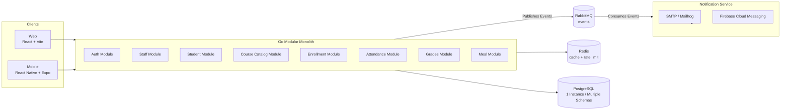

# MyDreamCampus

A full-stack university management platform built with a **Modular Monolith** architecture. Handles student enrollment, course scheduling, attendance tracking, grading, and cafeteria operations across web and mobile.

## Screenshots

> _Placeholders — drop your captures into `docs/screenshots/` and update the paths._

| Web | Mobile |
|-----|--------|
|  |  |

## Architecture

The project recently migrated from a highly fragmented microservices architecture to a robust **Modular Monolith** for simpler deployment, better performance, and easier maintenance. 



### Path to Microservices (Future-Proofing)
While the core backend runs as a single monolithic application, it is designed strictly as a **Modular Monolith**:
1. **Logical Separation:** Each module (Auth, Staff, Student) resides in its own isolated package under `internal/modules/`. Modules do not share state and communicate via clean Go interfaces.
2. **Database Isolation:** Even though there is only one PostgreSQL instance, each module owns its own **Database Schema** (e.g., `auth.users`, `course_catalog.courses`). There are no foreign keys across schemas.
3. **Event-Driven Communication:** Cross-boundary interactions (like notifying the system when a student enrolls) are handled asynchronously via **RabbitMQ**.

**How to split into Microservices?**
If a module (e.g., Enrollment) starts receiving massive traffic, you can easily extract its folder into a separate Go binary, spin up a dedicated PostgreSQL instance, and copy the `enrollment` schema. Since the code already respects module boundaries and uses RabbitMQ for cross-communication, extracting a service takes hours instead of months.

### Notification Mechanism (Email + Mobile Push)
The architecture includes an independent **Notification Service** that listens to RabbitMQ events. It acts as an intelligent dispatcher:
- **Important Events (e.g., Enrollment Complete, Graduation):** Dispatched via **Email** (Persistent) and **Mobile Push** (Instant).
- **Standard Events (e.g., Midterm Grade Entered):** Dispatched via **Mobile Push ONLY** (Fire & Forget) to optimize storage and avoid inbox spam.
- **MailHog:** Integrated into the Docker Compose stack for safely catching and viewing outgoing emails during local development.

## Tech Stack

**Backend**
- Go 1.26, Gin, pgx/v5, sqlc, goose
- PostgreSQL 18, RabbitMQ 4.0, Redis 7.2
- JWT + Argon2, Zap structured logging

**Frontend**
- React 19, Vite, Tailwind CSS v4, shadcn/ui
- TanStack React Query, React Hook Form + Zod
- React Router v7, ky HTTP client

**Mobile**
- React Native 0.81, Expo 54, Expo Router
- TanStack React Query, Axios, expo-secure-store

**Infrastructure**
- Docker Compose
- MailHog (Email testing)

## Project Structure

```
mydreamcampus/
├── new-backend/
│   ├── monolith/           # Modular Monolith core application
│   │   ├── internal/modules/ # Isolated domain modules (auth, staff, student, etc.)
│   ├── services/           # Independent asynchronous services
│   │   └── notification/   # RabbitMQ consumer for Email & FCM
│   └── infrastructure/     # Docker Compose (Postgres, Redis, RMQ, MailHog)
├── frontend/               # React + Vite web application
└── backend/                # Legacy microservices codebase (deprecated)
```

## Running Locally

**Prerequisites:** Docker (with the compose plugin), Go 1.26+, Node 20+, and `air` on `$PATH` for backend hot-reload (`go install github.com/air-verse/air@latest`).

```bash
# 1. Start Infrastructure (Postgres, Redis, RabbitMQ, Mailhog)
cd new-backend/infrastructure
docker compose up -d

# 2. Run the Monolith Backend (in a new terminal)
cd ../monolith
make run

# 3. Run the Notification Service (in a new terminal)
cd ../services/notification
go run cmd/main.go

# 4. Frontend (in a new terminal)
cd ../../../frontend
npm install
npm run dev
```

### Endpoints

- Web (Vite dev server): http://localhost:3000
- Backend API: http://localhost:8080/api/v1/*
- MailHog (Email Inbox): http://localhost:8025
- RabbitMQ management: http://localhost:15672 (`guest` / `guest`)

## License

MIT
